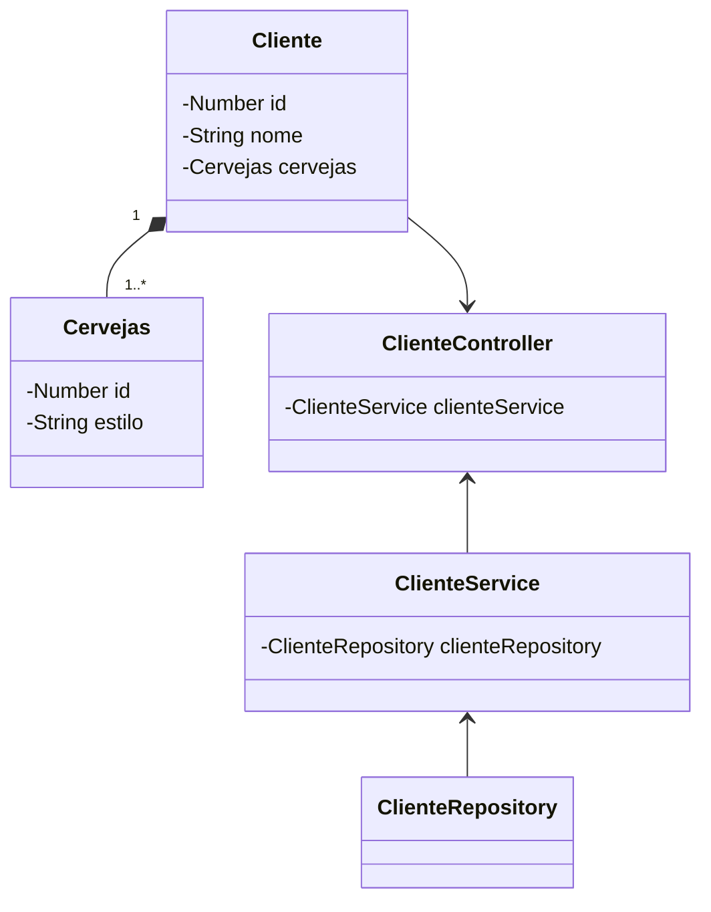

# Brewpub API

Java RESTful API criada para Negócios Cervejeiros!

## Principais Tecnologias
 - **Java 17**
 - **Spring Boot 3**
 - **Spring Data JPA**
 - **OpenAPI (Swagger)**

## Diagrama de Classes (Domínio da API)

## IMPORTANTE

Projeto criado para disponibilizar uma API local, sendo possível salvar (método HTTP POST) e buscar (método HTTP GET) utilizando a interface prática do Swagger através da URL:

### [localhost:8080/swagger-ui.html](http://localhost:8080/swagger-ui.html)
